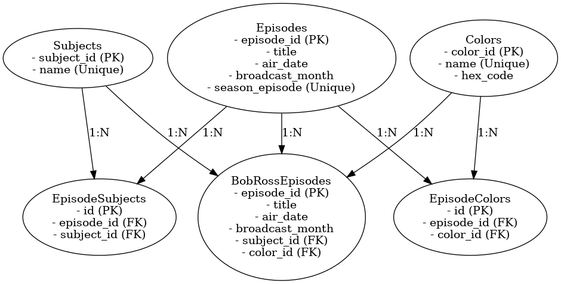

# Bob Ross Episodes API

This project is an API designed to provide data on the 403 episodes of *The Joy of Painting* hosted by Bob Ross. It allows users to filter episodes based on broadcast month, subject matter, and color palette. The API is built using Flask and interacts with a PostgreSQL database.

---

## Features

- Retrieve a complete list of episodes.
- Filter episodes by:
  - **Month of Original Broadcast**: Find episodes aired during a specific month.
  - **Subject Matter**: Search episodes based on the items painted (e.g., "Mountain", "Tree").
  - **Color Palette**: Search episodes using specific colors (e.g., "Phthalo Blue").
- Combine multiple filters with `match_all` support:
  - **Match All**: Returns episodes matching **all specified filters**.
  - **Match Any**: Returns episodes matching **any specified filter**.

---

## Installation

### Prerequisites

- Python 3.9+
- PostgreSQL
- Virtual environment (optional but recommended)

### 1. Clone the Repository

- git clone https://github.com/bcart01v/atlas-the-joy-of-painting-api
- cd bobross-episodes-api

## Set up Database

1. Create a PostgreSQL Databse;
`CREATE DATABASE painting_db;`

2. Run the schema SQL file to set up the database structure:
`psql -U postgres -d painting_db -f database/schema.sql`

3. Load Data into Database
`python3 database/load_data.py`

## Running the API
1. Set up a virtual environment (Optional)
`python3 -m venv venv source venv/bin/activate  # On Windows: venv\Scripts\activate`
k
2. Install Dependencies
`pip install -r requirements.txt`

3. Run the API
`python3 backend/app.py`

## Endpoints
Base URL
http://127.0.0.1:5005

### Filter Episodes
- Endpoint /episodes
- Method: Get
- Query Parameters:
    - broadcast_month(Optional) The month the Episode aired 
    - subject(Optional): The subject matter painted
    - color(Optional): The color used in the episode
    - match_all (Optional, default=false)
        - True: episodes must match all filters
        - False: episodes must match any filters

### Filter by Broadcast Month
- Endpoint: /episodes
- Method: Get
- Query Paremeters:
    - broadcast_month: The broadcast month to filter by

### Filter by Subject Matter
- Endpoint: /episodes
- Method: GET
- Query Parameters:
    - subject: The subject matter to filter by

### Filter by Color Pallet
- Endpoint: /episodes
- Method: GET
- Query Parameters: 
    - Color: the color to filter by

#

- Example
`http://127.0.0.1:5005/episodes?broadcast_month=January&subject=Mountain&color=Phthalo%20Blue&match_all=true`

## Testing the API
You can test this API with tools like
- Postman
    - import the API endpoint into Postman and provide the query parameters in the "Params" section.
- curl
    - `curl "http://127.0.0.1:5005/episodes?broadcast_month=January&subject=Mountain"`
- Your web browser for simple GET requests
    - Simply open the API URL with query parameters in your web browser.

## Project Structure

├── api/
│   ├── theapi.py            # API logic and routes
├── backend/
│   ├── app.py               # Flask application entry point
├── database/
│   ├── schema.sql           # Database schema
│   ├── load_data.py         # Script to load data into the database
├── data/
│   ├── raw/                 # Raw input data
│   ├── cleaned_up/          # Cleaned data for loading into the database
├── etl/
│   ├── etl_pipeline.py      # ETL pipeline to clean and prepare data
├── requirements.txt         # Python dependencies
├── README.md                # Project documentation

## Database UML

## Authors
[Benjamin J Carter](https://github.com/bcart01v)

## Requirements
For requirements, see [Requirements Documentation](Requirements.MD
)